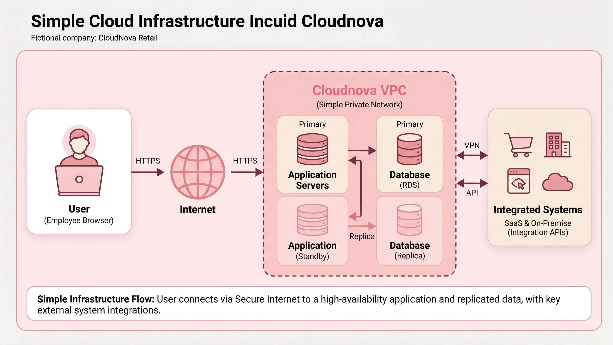

# Laboratory 02: Build the Cloud Infrastructure Blueprint

## Mission Overview

This laboratory focused on exploring the basic building blocks of cloud infrastructure through a Linux server environment provided by the KillerCoda Playground. The activity involved examining the server's compute, storage, networking, and operating system resources using Linux terminal commands.

The laboratory also involved documenting the observed infrastructure, comparing equivalent services offered by Amazon Web Services (AWS), Microsoft Azure, and Google Cloud Platform (GCP), and creating a simple cloud infrastructure architecture diagram.

## Learning Objectives

By completing this laboratory, I was able to:

- Identify the major components of cloud infrastructure.
- Examine the hardware and software resources of a Linux-based server.
- Investigate CPU, memory, storage, networking, and operating system information.
- Explain the role of compute, storage, networking, and operating system resources in cloud computing.
- Compare similar services offered by AWS, Microsoft Azure, and Google Cloud.
- Create technical documentation using Markdown.
- Organize laboratory evidence and documentation in a GitHub repository.

## Server Environment

The investigation was performed using the Ubuntu Linux environment provided by the KillerCoda Playground.

| Resource | Observed Information |
|---|---|
| Operating System | Ubuntu 24.04.4 LTS |
| Kernel | `6.8.0-138-generic` |
| CPU | Intel Xeon E312xx (Sandy Bridge, IBRS update) |
| CPU Cores | 1 virtual CPU core |
| RAM | 1.9 GiB |
| Virtual Disk | 20 GB `vda` |
| Root Partition | 19 GB ext4 mounted at `/` |
| Hostname | `ubuntu` |
| Primary Network Interface | `enp1s0` |
| Primary IP Address | `172.30.1.2/24` |

More detailed results are documented in the [Infrastructure Report](infrastructure-report.md).

## Cloud Infrastructure Components

The investigation identified four major infrastructure components:

| Component | KillerCoda Observation |
|---|---|
| Compute | 1 virtual CPU core using an Intel Xeon E312xx processor |
| Storage | 20 GB virtual disk with a 19 GB ext4 root partition |
| Networking | Active `enp1s0` interface with IP address `172.30.1.2/24` |
| Operating System | Ubuntu 24.04.4 LTS with Linux kernel `6.8.0-138-generic` |

Detailed explanations of the purpose and importance of each component are provided in [Cloud Infrastructure Components](cloud-components.md).

## Linux Commands Used

The server resources were examined using standard Linux commands.

| Command | Purpose |
|---|---|
| `cat /etc/os-release` | Identify the operating system |
| `uname -r` | Identify the Linux kernel version |
| `lscpu` | Display CPU information |
| `nproc` | Determine the number of CPU cores |
| `free -h` | Display memory information |
| `lsblk` | Examine disks and partitions |
| `df -hT` | Examine filesystem capacity and mount points |
| `hostname` | Display the server hostname |
| `hostname -I` | Display assigned IP addresses |
| `ip -br addr` | Display network interfaces and addresses |

## Cloud Provider Comparison

The laboratory compared three major cloud platforms:

- **Amazon Web Services (AWS)**
- **Microsoft Azure**
- **Google Cloud Platform (GCP)**

The comparison included equivalent services for compute, storage, networking, and identity and access management.

See the complete comparison in [Cloud Provider Comparison](cloud-provider-comparison.md).

## Cloud Architecture

The architecture diagram represents a simplified cloud infrastructure flow from the user to the cloud environment and its computing and storage resources.

## Evidence

The following screenshots document the investigation performed in the KillerCoda environment:

- [Server Information](screenshots/server-information.png)
- [Network Information](screenshots/network-information.png)
- [Storage Information](screenshots/storage-information.png)
- [Cloud Architecture Diagram](screenshots/cloud-architecture.png)

## Skills Developed

Through this laboratory, I developed practical experience in:

- Using Linux terminal commands
- Investigating virtual server resources
- Interpreting CPU and memory information
- Examining disks, partitions, and mounted filesystems
- Identifying network interfaces and IP addresses
- Understanding basic cloud infrastructure components
- Comparing major cloud service providers
- Creating cloud architecture diagrams
- Writing technical documentation in Markdown
- Organizing project files and evidence using GitHub

## Challenges Encountered

One of the main challenges was understanding that the Linux environment provided by KillerCoda represents a virtual server rather than the physical laptop being used to access it. This helped me distinguish between the resources of my local computer and the resources assigned to the cloud environment.

Another challenge was interpreting the output of different Linux commands and organizing the results into useful documentation. Running the commands individually and recording their results made the investigation easier to understand and document.

## Laboratory Documentation

- [Cloud Infrastructure Components](cloud-components.md)
- [Cloud Provider Comparison](cloud-provider-comparison.md)
- [Infrastructure Report](infrastructure-report.md)
- [Mission Reflection](reflection.md)
- [Screenshots and Evidence](screenshots)

## Mission Reflection

My overall reflection on the laboratory experience is available in [Mission Reflection](reflection.md).
